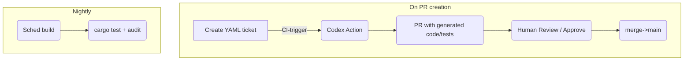

Below is a **delta-update** to the spec that assumes your “development team” is mostly — or entirely — OpenAI Codex-powered automation, with you (and any auditors) providing human review and sign-off.

---

## **P-PoR Spec v0.5 – Codex-First Delivery Model**

> **Unchanged sections** (Purpose, Scope, Architecture, Security, Deliverables) still apply.
> Only the organisational & process parts are rewritten.

| Section                  | Change                                                             |
| ------------------------ | ------------------------------------------------------------------ |
| **Stakeholders & Roles** | Collapse to three human roles + Codex engine                       |
| **Milestones**           | Much shorter sprints; use “prompt cycles” not man-days             |
| **Backlog Format**       | YAML files that Codex ingests; each ticket = self-contained prompt |
| **Workflow**             | GitHub Actions triggers Codex generations; humans review PRs       |
| **Tooling**              | Add `openai-codex-ci` runner; add `codemod` auto-refactor stage    |

---

### 1  Stakeholders & Responsibilities (Codex Model)

| Role                 | Person / Agent              | Duties                                      |
| -------------------- | --------------------------- | ------------------------------------------- |
| **Product Owner**    | **Adam Malin**              | Business logic, acceptance tests, prompt QA |
| **Codex Dev Engine** | *OpenAI Codex 16-k context* | Generate / refactor Rust, Circuits, docs    |
| **Security Auditor** | External firm               | Final cryptographic review                  |
| **Release Steward**  | *GitHub Action + GPG bot*   | Deterministic build, tag, sign Artifacts    |

---

### 2  Automation-Centric Workflow



#### 2.1  Ticket Format (`tickets/XYZ.yaml`)

```yaml
id: BP-04
description: |
  Implement Bulletproofs wrapper that exposes
    commit(v,r) and prove_sum_geq(min).
acceptance:
  - cargo test --package ppor_circuit passes
  - prove_sum_geq handles 64-bit values <= 21e14
context_snippets:
  - src/ppor_circuit/lib.rs:L1-120
  - docs/math/bulletproofs_overview.md
```

Codex Action reads the YAML, streams prompt → code, commits a new branch `codex/BP-04`, and opens a PR.

#### 2.2  Human Review Checklist

1. **Compiles & tests green** in CI.
2. Diff contains *no* unsafe Rust, `todo!()` or obvious side-channel.
3. Added/updated doc-comments OK.
4. Cargo-audit returns 0 vulnerabilities.

---

### 3  Milestones (Prompt-Cycle View)

| Cycle                      | Objective                              | Codex Tickets                            | Human SLA        |
| -------------------------- | -------------------------------------- | ---------------------------------------- | ---------------- |
| **C1**  (June 2 – 6)       | Project skeleton, snapshot helper stub | `BP-00` init, `SN-00` snapshot, `CLI-00` | 48 h code review |
| **C2**  (June 9 – 13)      | Bulletproofs single-input PoC          | `BP-01`, `TEST-01` fuzz                  | 48 h             |
| **C3**  (June 16 – 20)     | Multi-input aggregation, progress bars | `BP-02`, `UX-01`                         | 48 h             |
| **C4**  (June 23 – 27)     | Ownership Schnorr gadget               | `OWN-01`, `TEST-02`                      | 72 h             |
| **C5**  (June 30 – July 4) | End-to-end demo, tag `v0.1.0`          | `DEMO-01`, `DOC-01`                      | 72 h             |

*(Each “cycle” ≈ one week, assuming Codex can turn tickets within minutes to hours.)*

---

### 4  CI/CD Add-Ons

1. **`openai-codex-ci@v1` GitHub Action**

   * Inputs: `OPENAI_API_KEY`, ticket YAML path
   * Outputs: PR branch with generated code & tests
2. **`codemod-lint` stage**

   * Runs `rustfmt`, `clippy --deny warnings`, automatic crate-feature pruning
3. **`semantic-pr-title` bot** – validates PR naming: `feat(bp): ...`, `fix(cli): ...`

---

### 5  Updated Immediate TODOs

| Ticket   | Prompt Summary                                                                                                                                                         | ETA by Codex | Reviewer |
| -------- | ---------------------------------------------------------------------------------------------------------------------------------------------------------------------- | ------------ | -------- |
| `SN-00`  | *“Write a Rust binary `snapshot_tool` that connects to a `bitcoind` RPC, iterates the UTXO set at a given height, emits a compact Merkle tree, and prints root hash.”* | < 1 h        | Adam     |
| `BP-00`  | Scaffold `ppor_circuit` crate with feature-flag back-ends (`bulletproofs`, `halo2`), compile empty tests.                                                              | < 30 min     | Adam     |
| `CLI-00` | Generate Clap boilerplate (`generate`, `verify`) with progress bars.                                                                                                   | < 30 min     | Adam     |

*(Put these YAML files in `tickets/` and push; CI will spawn Codex PRs.)*

---

### 6  Guidance for Writing Tickets / Prompts

```
DO:
• Provide exact crate versions & Cargo feature flags.
• Include code context snippets for Codex to patch.
• State *binary* acceptance commands (cargo test, cargo run).
DON’T:
• Leave high-level hand-wavy tasks (“make it faster”).
• Ask Codex to pick libraries — lock them first in ticket.
```

---

**Next step:**
Create the three seed tickets (`SN-00`, `BP-00`, `CLI-00`) and push to `main`. The Codex CI runner will open the first PR within minutes for your review.
